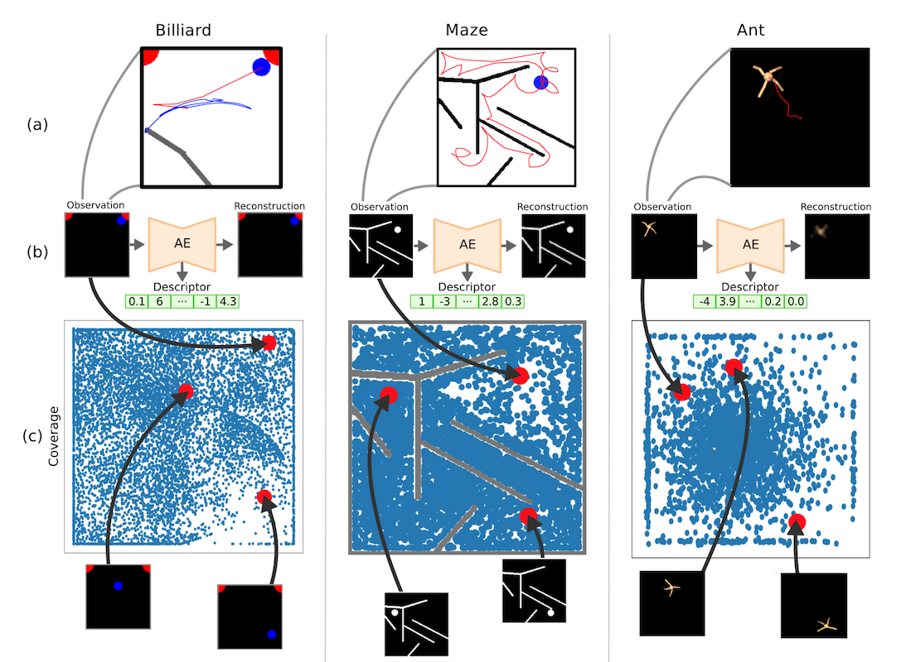

# Cooperative Exploration梗概

:fountain_pen: ​彭正皓

<!--\*\*\* 注意：之前写过一个《Generate a Population of Diverse Agents in One Pass》的草稿，那个是同一个问题的不同故事-->

<!--## ~~Abstract~~-->

<!--~~我们提出利用多个agent进行合作探索的算法。~~-->

<!--~~agent的策略是不同质的，能带来单个agent无法访问的新信息（对比起多个actor同时采样）。~~-->
<!--~~agent的任务是同质的，因此可以直接比较不同agent的行为（若任务不同则无法直接比较）。~~-->
<!--~~利用joint dataset计算的到的policy embedding可以直接计算agent的差异，而无需autoencoder。~~-->
<!--~~利用policy embedding计算得到的agent距离为最大化的目标，这就是“逆模仿学习”（IIL）~~-->
<!--~~巧妙的融合方式将原始目标和IIL目标（1.仿循迹算法，2.基于performance升降，3.TNB）融合。-->

## Introduction

### 背景、重要性、相关工作、任务

1. 在RL中探索是一个很重要的问题。
2. 但现有方法无非集中于state、parameter、action（distribution）层面进行探索。
3. 我们指出，现有**所有方法**都高度依赖于agent本身的知识，即与agent业已学会的trajectory高度相关。因此，exploration的结果高度取决于agent的初始化以及过往经验。
4. 虽然有很多相关工作试图解决这个问题，比如使用off-policy buffer、使用训练不同阶段的agent作为target-policy等等。但我们指出，尽管如此，从整体上看所有采集的数据依然高度取决于policy的过往经验。
5. 另一方面，我们观察到在强化学习中，agent的行为、表现和随机种子影响甚大。这是因为初始化的随机性使得policy有了不同的行为方式，而不同的行为方式又会因为MDP的随机性而不断放大。即使经过了训练，这种因随机种子导致的初始化也很难被均化。
6. 我们指出，这个现象的原因是由于不同的随机种子存在，agent在state-action space的不同区域从头开始训练，agent无法突破state-action space固有的一些区域性限制。**这是路径依赖的显然表现**。
7. 因此，我们希望有一种探索方法，让一个agent能够分享其他agent的经验，从而指导自己的学习。能否把一个agent的直接经验经过某种转换，成为间接经验，从而“教授”给自己的同伴。

<!--~~我们指出一个显然的矛盾，即~~-->
<!--   1. ~~采样的policy和训练的policy要足够近：否则采样得到的数据不能用于训练policy，但这样做又会造成sample efficiency下降；~~-->
<!--   2. ~~采样的policy和训练的policy要足够远，否则样本随机性太少，不能获得新知识，但这样做又导致采样policy的样本无法用于训练的policy。~~-->
<!--   3. ~~如果采用online learning，可以认为采样策略和训练策略太近，sample efficiency太少，且会遇到“遗忘过去”的问题。~~-->

### 方法

一个简单的想法就是，将其他agent采样的到的transition纳入我的学习中。我们考察了两种典型的on-policy和off-policy算法。

#### PPO

观察到：

1. PPO算法没有明显的critic结构，而是将critic和policy融为一体，通过一个loss一起训练。而且此Critic结构是state value估计，而非state-action value估计，因此无法将他人的action作为输入来独立训练critic。
2. PPO算法是on-policy算法，没有buffer，无法收集过去的数据。

我们指出：

1. 可以直接将其他agent采集到的数据，假装为原本策略的数据，从而输入PPO。
2. 因为PPO中自带双策略采样数据差异的限制（clip项或者KL项）。

总结，我们的方法是：**直接将其他agent采集到的数据，假装为原本策略的数据，从而输入PPO。**

#### TD3

观察到：

1. DDPG类算法具有明显的critic结构，且此critic是state-action value估计器。因此可以将他人的state、action作为输入独立进行训练。
2. TD3具有buffer，本身就可以收集与训练策略不同的策略所收集的数据。

我们指出：

1. 可以将他人的state、action pair直接传入DDPG的replay buffer中进行训练。
2. 我们既可以直接将这个“增广buffer”用来训练整个agent，也可以仅仅用其训练critic（事实上，这就是central critic）。

总结，我们的方法是：将他人的state、action pair直接传入DDPG的replay buffer中进行训练。

### 结果

我们期待：

1. 【覆盖更广】在某种精心设计的迷宫环境中，
   1. 相比1个agent，我们的算法可以覆盖更广范围的state-action space。
   2. 相比10个agent，我们的算法（10个agent共同）可以覆盖更广范围的state-action space。
2. 【收敛更快】在相同采样步数的情况下，我们的算法比对应的原始算法收敛更快。

## Method

### On Policy 算法改进

### Off Policy 算法改进

## Experiment

### 覆盖更广实验

环境：上图展示了一个进化的文章所使用的三个环境。他们希望训练出一大堆policy来填满search space。我们可以利用这些环境来演示一下三个情况：

1. agent只采取决定性的动作，比如argmax（离散）或直接采用均值（连续）。【问题：TD3本身就是确定性的？】
2. 一个基本训练的差不多的agent（也就是有一个比较明确的路径了），采集N次采样的结果（完全模仿training状态），然后plot出heatmap来（访问过的位置用深浅画在二维图上）。
3. K个agent，然后只采样N/K次的结果。plot出heatmap来。

我们期待：**3的图会比2更加分散。**

于是我们证明了：**同样sample数目下，异质agent采样更广泛。**

预期图表：

1. 【表】列：三个演示环境的coverage。行：5个算法。
2. 【图】两张map俯视图做对比。深浅表示访问这个位置的次数。可以画一条实线表示deterministic动作的轨迹是啥。

### 训练更快实验

寻找几个比较正常的环境，比如humanoid（重点）、walker、halfcheetah、bipedalwalker-hardcore、atari四人组之类。直接开训。

预期图表：

1. 【图】横轴：采样数目，纵轴：performance。10agent群体的：mean、max、min，10个独立agent的mean、max、min（总共有三个数值，每个数值N个方法对比，每个方法都有3个种子，这样就有三个图，每个图N条线。在这里N=5）

<!-- ## Related Work-->

<!-- ### Exploration方面-->

<!-- #### Influence-based Multi-agent Exploration-->

<!--本文强调了MARL中不同agent的互动。提出了两种衡量一个agent对另一个agent的“influence”的指标，并以此提出两种通过鼓励互动的方法。问题在于，这里所鼓励的exploration是MARL层面上的探索，强调的是一个agent对另一个agent的影响（比如我去摁开关，你去爬电动楼梯这种合作），而非同质化的若干个agent，在单个agent自己的独立任务中的exploration。-->

 <!-- #### Competitive Experience Replay-->

<!--为了解决稀疏奖励的问题，本文用一对agent，如果A访问到B曾经访问过的相同的state，则A奖励-1，否则+1。思路很简单，问题在于：1. 只有两个agent。（否则reward就很难设计，比如一个state十几个人都去过了该怎么办？）2. 改变了reward的形态。（而我们不是在reward层面，而是在loss、gradient层面施加干预的。）-->

<!-- #### Unsupervised Learning and Exploration of Reachable Outcome Space--> 
